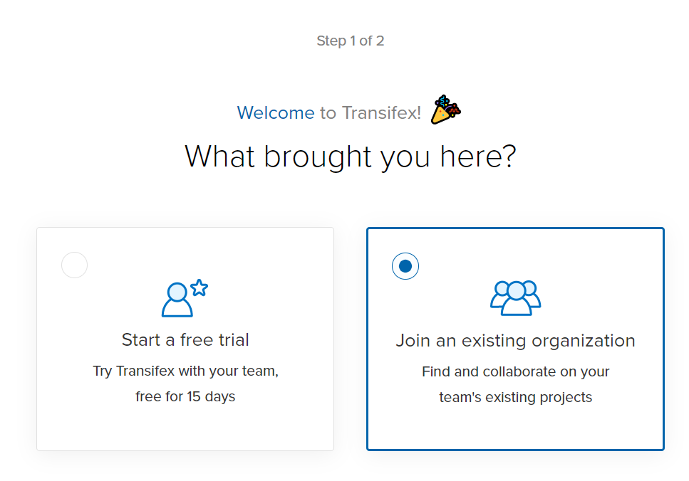

Contributing to 6940swerve-docs
=============================================================

Translation
-------------

1. Create a `Transifex <https://www.transifex.com/>`_ account.

.. image:: images/Contributing-1.png
    :alt: Transifex account

2. After you create a Transifex account, you will see the page below. Click the **Join an exist organization** and enter the necessary information.

3. Click this  `link <https://www.transifex.com/frc-team-6940-1/6940swerve-docs/>`_ and post a request to join in the organization to translate 6940swerve-docs.

4. Start your translation journey!

Write articles
---------------

1. You need to clone the `repo <https://github.com/mendax1234/6940Swerve-docs>`_ from Github.

2. Test