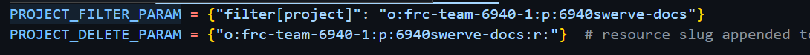
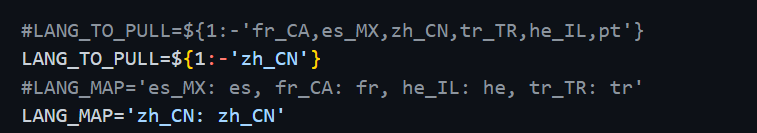
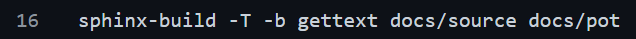

Contributing to 6940swerve-docs
=============================================================

Translation
-------------

**How to translate this documentation**
1. Create a `Transifex <https://www.transifex.com/>`_ account.

.. image:: images/Contributing-1.png
    :alt: Transifex account

2. After you create a Transifex account, you will see the page below. Click the **Join an exist organization** and enter the necessary information.

.. image:: images/Contributing-2.png
    :alt: Choose mode

3. Click this  `link <https://www.transifex.com/frc-team-6940-1/6940swerve-docs/>`_ and post a request to join in the organization to translate 6940swerve-docs.
4. Start your translation journey!

**More about how our translation flow works**
.. note:: Thanks `frc-docs-translation <https://github.com/wpilibsuite/frc-docs-translations>`_ for providing us with such good resources for reference. And all of our translation works are automatic!

Introduction
++++++++++++++

There great work is done by Github Action with several automatic scripts.

How to adapt this workflow to your own project
+++++++++++++++++++++++++++++++++++++++++++++++++

1. Copy and past the `scripts/`, `.github/workflow/` and `requirements.txt` folders to your project's root directory.
2. Change the corresponding parts in `scripts/lock-translations.py`, `scripts/update.sh`, `.github/workflow/publish_main.yml`, `.github/workflow/update-translations.yml`.

++++++++++++++++++++++++++++++++++++++
In `scripts/lock-translations.py`
++++++++++++++++++++++++++++++++++++++

1. Change `PROJECT_FILTER_PARAM` and `PROJECT_DELETE_PARAM`

`PROJECT_FILTER_PARAM = {"filter[project]": "o:Your organization on Transifex:p:Your project name"}`
`PROJECT_DELETE_PARAM = {"o:Your organization on Transifex:p:Your project name:r:"}`

.. note:: `Your organization on Transifex` can be found in the URL of your Transifex project. And remember that all the letters are lowercase.

2. Change content in the quotes to your project's name.

++++++++++++++++++++++++++++++++++++++
In `scripts/update.sh`
++++++++++++++++++++++++++++++++++++++
1. Change the `LANG_TO_PULL` and `LANG_MAP` to the language you want to be translated into.

2. Change the `MAINPROJECT` name to your project's name.

3. Change the last two arguments in the below to the directory to your `../source/`(where you `conf.py` locates) and the location where you want to put your `.POT` files.

4. Change the two underlined parts in the below image to the directory where your `.POT` files locate and where your translation files(which can also be called `.PO` files) locate.

++++++++++++++++++++++++++++++++++++++
In `.github/workflow/publish_main.yml`
++++++++++++++++++++++++++++++++++++++
You know which parts should be changed and l won't go into it here.

++++++++++++++++++++++++++++++++++++++++++++++
In `.github/workflow/update-translations.yml`
++++++++++++++++++++++++++++++++++++++++++++++
1. Change the `github.repository` to your own repo.
2. If you don't have a Submodule, just annotate the related three lines.
3. Create a repository secret in your repository's settings , name it as `TX_TOKEN` and paste your Transifex api token in the secret.

**Now you can test whether your workflow works well!**

Write articles
---------------

**Things you need to know before writing articles for 6940swerve-docs**

a. Basic reStructuredText syntax.
b. Novel ideas for improving the articles.

**If you meet the above requirements, keep reading!**
1. You need to clone the `repo <https://github.com/mendax1234/6940Swerve-docs>`_ from Github.
2. Enter the `docs/source/docs` directory and start writing articles.
3. Once you are done, create a pull request to the `repo <https://github.com/mendax1234/6940Swerve-docs>`_.
4. Once the pull request is merged, you can start translating the articles or wait for other people to translate it.

