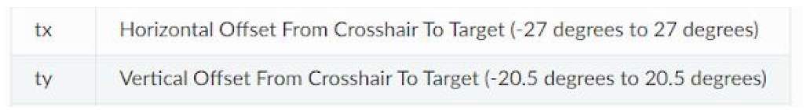
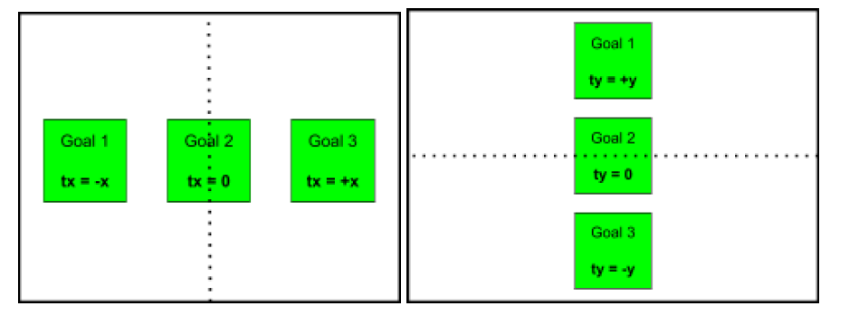

Goal Centric (Starring the Limelight)
=======================================

In this section, we shall discuss integrating the `Limelight <https://docs.limelightvision.io/en/latest/getting_started.html>`_` with swerve. We are assuming that you
have some knowledge about the Limelight . If you are using another form of vision processing, the
concepts we will discuss should still be relevant.

Vision Targeting
------------------

Essentials
+++++++++++

Almost all vision processing software should give you two very useful variables: tx & ty . Below is the
description of these variables from the `Limelight documentation <https://docs.limelightvision.io/en/latest/networktables_api.html>`_.

In the simplest targeting implementations, all you need is `tx`. More complex targeting
implementations will also utilize `ty`.

In the left diagram, we show how the Limelight reports tx values. The black dotted line shows us the
y-axis, where tx = 0. We can see that tx tells us how far LEFT (- tx ) or RIGHT (+ tx ) the target is from
the center of the Limelight.

In the right diagram, we show how the Limelight reports ty values. The black dotted line shows us
the x-axis, where ty = 0. We can see that ty tells us how far UP (+ ty ) or DOWN (- ty ) the target is from
the center of the Limelight.

Easy Mode
+++++++++++

The simplest vision targeting PID you can do only uses `tx` . Basically, you just want to turn towards
the goal. This is done by applying a calculated correction in the opposite direction of `tx` . Here is
what your targeting PID function might look like:

::

    double limelightXPID(double tx){
        double kP = 0.008;
        double correction = tx * kP;
        return correction;
    }

The kP should convert the error into a number you can use later in your method to move the
drivetrain ( teleop or auton ).

Unfortunately, this implementation isn't perfect. Oftentimes, the robot doesn't have enough power
to correct when it is fairly close to the goal. The best solution we found is in the next section.

Advanced Mode
+++++++++++++++++

A more advanced version of the vision targeting PID implements a minimum correction and an error
deadzone . Just like the previous one, tx is used the same way. However, the minimum correction
allows the robot to creep into place and the error deadzone allows the robot to stop when it's close
enough. Here is what your targeting PID function might look like:

::

    double limelightXPID(double tx){
        double kP = 0.008;
        double correctionMin = 0.003;
        double deadZone = 0.05;
        double correction = tx * kP;
        if(correction < correctionMin) correction = copysignf(correctionMin, correction);
        if(abs(tx) < deadZone) correction = 0;
        return correction;
    }

Hard Mode
++++++++++++

A harder version of the vision targeting PID adds an integra l into the mix. Just like the previous
approaches,9 tx is used the same way. However, the integra l adds a little power at the end to help
the robot crawl right into proper positioning. The integra l replaces the minimum correction seen in
the previous section. Here is what your targeting PID function might look like:

::

    double integral = 0;
    double limelightXPID(double tx){
        double kP = 0.008;
        double deadZone = 0.05;
        double kI = 0.001;
        double IZone = 4.0;
        double ILimit = 1000.0;
        if(abs(tx) < IZone) integral += tx;
        if(abs(integral) > ILimit) integral = 600 * integral/abs(integral);
        double correction = tx * kP + integral * kI;
        if(abs(tx) < deadZone) correction = 0;
        return correction;
    }

.. note:: tuning the integral can be extremely difficult. From our own experience taking the advanced approach is much easier and has very similar results to this implementation.

Expert Mode
++++++++++++++

A more complex version of the vision targeting PID utilizes both tx & ty . Just like the previous ones,
tx is used the same way. However, now ty is used to calculate the distance from the goal. Depending
on the year and setup of your robot, your use of ty can vary. We will briefly discuss a few of the most
common ones.

Because ty gives us the vertical offset (in degrees) we are away from the target, we can use that to
achieve a specific position. (For the purposes of simplicity, we are using the pseudocode from this
example.) Here is what your targeting PID function might look like:

::

    double limelightXPID(double tx){
        double kP = 0.008;
        double correctionMin = 0.003;
        double deadZone = 0.05;
        double correction = tx * kP;
        if(correction < correctionMin) correction = copysignf(correctionMin, correction);
        if(abs(tx) < deadZone) correction = 0;
        return correction;
    }
    double limelightY PID(double ty){
        double kP = 0.008;
        double correctionMin = 0.003;
        double deadZone = 0.05;
        double correction = ty * kP;
        if(correction < correctionMin) correction = copysignf(correctionMin, correction);
        if(abs(tx) < deadZone) correction = 0;
        return correction;
    }

Together, these two PIDs enable your robot to turn towards and line up to the target, while driving to
a desired distance away from the target. You can change the distance from target position by
adding an offset to ty ( ty - 3).

Another use for ty is to use the “distance” to enhance your scoring mechanism. For example, you
can change the speed of a shooter wheel based off of your distance, or the angle of a shooter hood.
You can adjust the height of an elevator based on the vertical offset, or even disable scoring until
your robot is close enough to place the game piece. The use of ty is only limited by your
imagination. Because there are so many possibilities, we will not show any pseudocode.

Goal-Centric
-----------------

Introduction
+++++++++++++++

In goal centric, instead of the driver joysticks referencing the field (as in field-centric control), they
reference a specific goal or target. In the 2020 season, we specifically targeted the Upper Power
Port. In the 2019 season, we targeted the Loading Station, Cargo Ship, and Rocket for Hatch
placement. Essentially, you want to target any major field element to make it easier and faster to
score. If implemented properly, the robot will naturally face the goal and strafe in an arc around it.

How It's Done
+++++++++++++++

If you are using just tx to line up with the goal, here is what your code may look like:
move(fwd, rot + limelightXPID(tx), str);

Notice that the tx PID is added to rotate . We just want our robot to look at the target. So, all we have
to do is turn toward the goal. We are only aiming using the Limelight , not moving.

If you are using both tx and ty to line up with the goal, here is what your code may look like:
move(fwd + limelightY PID(ty), rot + limelightXPID(tx), str);

In addition to tx , notice that the ty PID is added to forward . We want our robot to drive to a specific
location relative to the target. So, we have to drive toward/away from the goal. We are moving to a
set position, while looking at the target.

These functions must be called every cycle. The robot can't properly correct invalid positioning
based on old data.