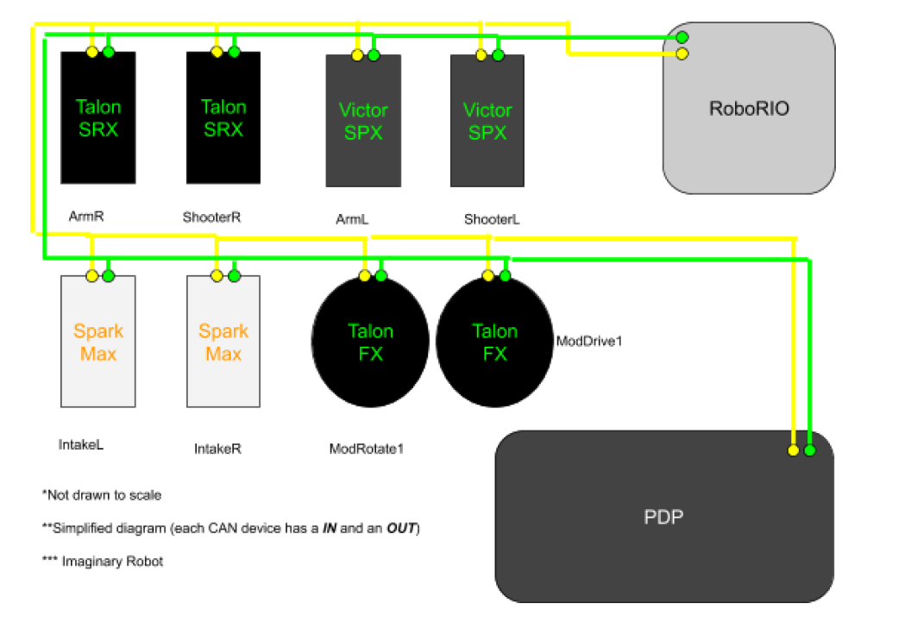
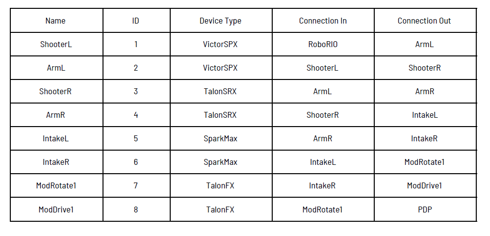
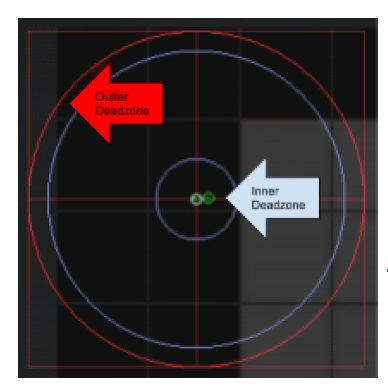
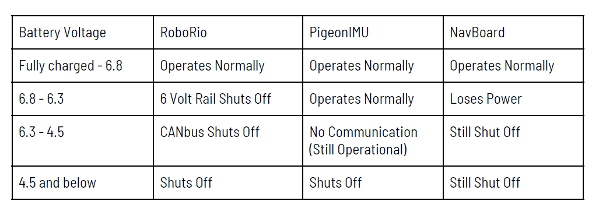
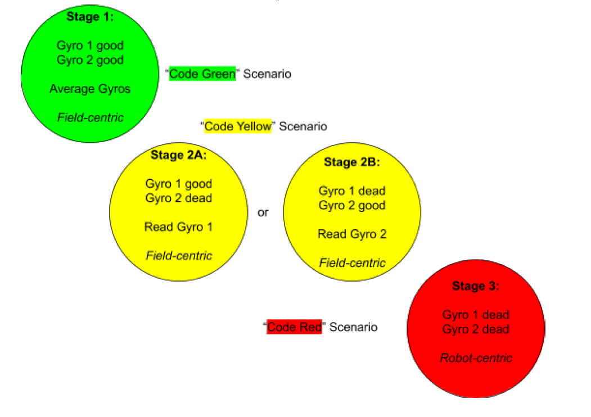

Other Misc. Tips & Tricks
==============================

“Zero” Azimuth Position & Pre-Match Module Testing
----------------------------------------------------

In order to make sure that your robot is functioning properly, you have to check to make sure that
things remain in alignment. That includes making sure that the wheel rotation encoders stay true.
There are a couple of things that mechanically could go wrong and misalign the wheels, the encoder
could come loose, the gear driving the encoder could become damaged and a number of other
things. To prevent these things from affecting our gameplay, we created a way to check our
azimuth.

We made a few attempts to make physical measurement tools to simplify checking if the wheels
were properly aligned. After several complex procedures, we developed a simple way to confirm
that the wheels are parallel to the frame. We tip the robot on the side and put a level on each wheel
after we told the wheels to point to the front.

We added a button in Test Mode that would tell all the wheels to face zero degrees relative to the
robot. We also added a button to slowly rotate the wheels. That procedure gives us several points of
feedback. We can observe the speed at which the wheels rotate relative to each other. We can
listen for sounds that indicate mechanical changes. We can watch for smooth motion. It also allows
us to move the wheels from the front-facing position then push the button to face front again.

Another part of the prematch test is running the modules in Teleop Mode with the wheels off the
floor. That allows us to check for any mechanical changes to the drive motor functionality in
addition to the spin function.

Protect Your Reset Buttons!
------------------------------

Reset Buttons: a necessary evil. They should only be pressed when you want them to be pressed,
right?! Well, it's not something people think about as often as they should. Trust us, we fell into this
trap too.

When we got our 2020 robot on the ground, our driver found a cool trick that made his forward
direction become his backward direction. Our electronics panel is on the bottom of this robot in a
very, very, very compact space. Our two gyros have somewhat open reset buttons that can easily be
touched by anything. When our driver went over the shield generator, the reset button would be
pressed and field centric is out the window. Every time it reset, he gave the programming team a
nice little grin and said “front isn't front anymore.” We couldn't understand why the gyros were not
working and would power cycle and reset. Finally we turned the robot upside down and found that a
cable was leaning directly on the reset button of our NavBoard.

Document Your CANbus Network Topology
--------------------------------------

Despite the CANbus allowing devices to be connected in almost any order, it is still very important
to know the network layout. Save yourself a lot of pain and suffering debugging your electronics!
Here are some tips we have to do this effectively:

1. Note the type, ID, and name for each device.
2. Trace the connections starting from the RoboRio to the PDP (or whatever the “end” of your CANbus is).
3. Record how each device is connected in the network in the same order you are tracing them.

Below is a simple example:

By methodically writing down this information, it will be infinitely easier and faster to:
a. Program these electronics on the robot.
b. Diagnose problematic devices & replace them.
c. Fix broken wires & connections.
Please, do this simple thing. We didn't until we were forced to. That was a huge mistake . The day
before our first competition in 2020, one of our motor controllers died. We spent at least 10 hours
chasing the problem. We didn't start down the right path until we knew exactly what the CAN
network looked like. Seriously, this helps make debugging significantly faster! Don't let your entire
electronics board falling out of your robot stop you from making it to your next match. We didn't; at
least, not in 2020.

Know Your Electronics
------------------------

Options, options, options… Electronics are all the bits and pieces of hardware that we interface
with through programming. We are always searching for that one sensor that will be even better
than the previous one. Maybe you found a new thingy that does the “ooh yeah” (aka what you really
need)! Now you have to reliably control it. Typically, we end up using less than 10 percent of the
functions available of some of our electronics. That could be a motor controller, a gyro, a lidar, a
proximity sensor, or a vision processor. You have to determine the capabilities and limitations of
the electronics. It starts with the mandatory electronics: the Roborio , the PDP , and the VRM . In
addition to the minimal operations, they all have programming in them that may be helpful. The
error messages that they output could help you reduce any lag time. The diagnostic capabilities
may allow you to prevent brownouts.

You should also have a variety of sensors on the robot. During the 2019 build season, we discovered
that a reflective line sensor could be also used to detect hatches. The sensor would reflect the
proper amount of light to signal the edge was within 24 inches. With that sensor at the correct
angle, we could tell if we were in possession of a hatch. Feel free to explore alternate uses. We have
used a variety of digital sensors to indicate the location of different things over the years. We also
use analog sensors to give us useful feedback. Lidar and vision processing can give us distance. An
accelerometer and gyroscope can tell you if you have run into something. A pressure sensor can tell
you how much air is in the pneumatics. An encoder can tell you a position or a speed. Knowing the
capabilities of your electronics is the only way to maximize performance.

Knowing the limitations of the electronics is a must for reliable programming performance . A simple
example of this is knowing that most CTRE devices have clearable error codes. Sometimes the
“sticky faults” will prevent the system from working at full speed because the expected data is not
arriving quickly enough. Testing is often necessary to acquire the limitations of a sensor, encoder,
or subprocessor. You will always need to know the point at which any feedback device is no longer
reliable. It could be a speed, a distance, or an angle.

Invest in Good Controllers… And You Should Interpolate
---------------------------------------------------------

Let's get real. Swerve feels AMAZING to drive. But, that's only if you have an AMAZING controller.
“What do we mean by AMAZING,” you ask? It boils down to “non-sticky” joysticks. Minimal dead
zones. Want to make the robot do “victory spins” whilst driving at 45°? Your joysticks need to have a
full range of motion.

This is an example of ideal radial dead zones. Realistically, no
controllers are perfect. But, AMAZING controllers are very
close. If you want to have even more natural feeling controls,
then you should implement radial dead zone interpolation.
Check out this website to learn more.
`<http://blog.hypersect.com/interpreting-analog-sticks/>`_

If you want to test and/or configure your controller, you can
do so right in Windows 10. Check out this walkthrough for
more information:
`<https://www.howtogeek.com/241421/how-to-calibrate-your-gaming-controller-in-windows-10/>`_

Makes sense right? To fully experience the epicness of swerve, you need to have quality inputs.
Swerve simply can't be at its best if it's being driven with a poor controller.

Seriously, Implement Brownout Protection!
--------------------------------------------

Brownout protection is very important with swerve, not only in auton but throughout the entire
match. If we were to brownout, we could lose both our gyros. Once the voltage comes into the range
of 6.3 to 6.8 volts our NavBoard would lose power as the 6 volt rail of the RoboRio turns off. In the
range 4.5 to 6.3 volts, all but the joystick communications to the RoboRio are lost. The PigeonIMU
can be powered by a Talon, therefore is more tolerable to brownout voltage conditions. The
PigeonIMU, when powered by a Talon, will not lose it's telemetry until the voltage drops below 4.5
volts, at which time RoboRio shuts down. If the RoboRio shuts down, there will be no CANbus
communication until it reboots again.

There are two ways to best minimize your chances of brownouts. The first way (that is
multi-purpose) is ramprate. It prevents the motors from drawing maximum amperage immediately,
by forcing a ‘ramp-up' of the motor controller output voltage, averting brownouts. The other
purpose of ramprate is to keep from braking traction, by stopping the wheels from accelerating too
rapidly. The second way to prevent brownouts is using current limiting. We used Falcon500 with the
integrated Talon motor controller. Once we found the correct level to set the limiting at, it worked
flawlessly. We used this method for most of our motors, from shooter to our climber to our drive
train. On our shooter, current limiting worked extremely well because we could get it up to speed
quickly without drawing too much amperage and browning out.

Handling Gyro Fault Conditions
---------------------------------

We have two gyros on our robot. In the event that one can't be used, we are still able to navigate. It's a
backup. We average both yaw readings together. If either one of the gyros goes down, the system
will use the reading from the other gyro. If both gyros go down, the system will switch to robot
centric mode until at least one gyro is regained.

We did program in a gyro reset function to account for this possibility, but it has not and should not be
needed in competition. This emergency gyro reset function is used to restore the robot's heading to
0 degrees for “field centric” operation. There is a reason why this shouldn't be relied on during a
match. If both gyros fail, you more than likely have bigger problems on your hands. Gyros don't fail
“randomly” all the time. There is always a cause behind it. Resetting the gyros is not going to fix
electronic robot barf. Or perhaps a bug in the code. It is dangerous to rely on sensor reset functions
instead of resolving the true issue. Please don't hear us wrong. Having emergency reset functions is
important; however, they should only ever be used in a true emergency.

**THE END… or is it…?**
**(It might be... who knows...)**